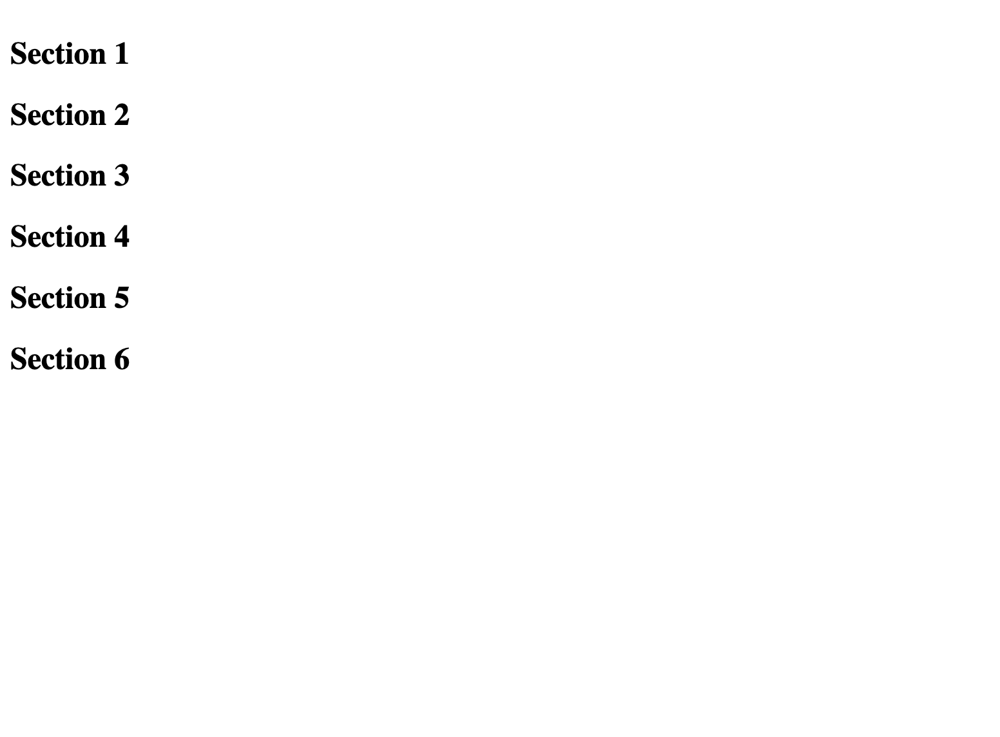
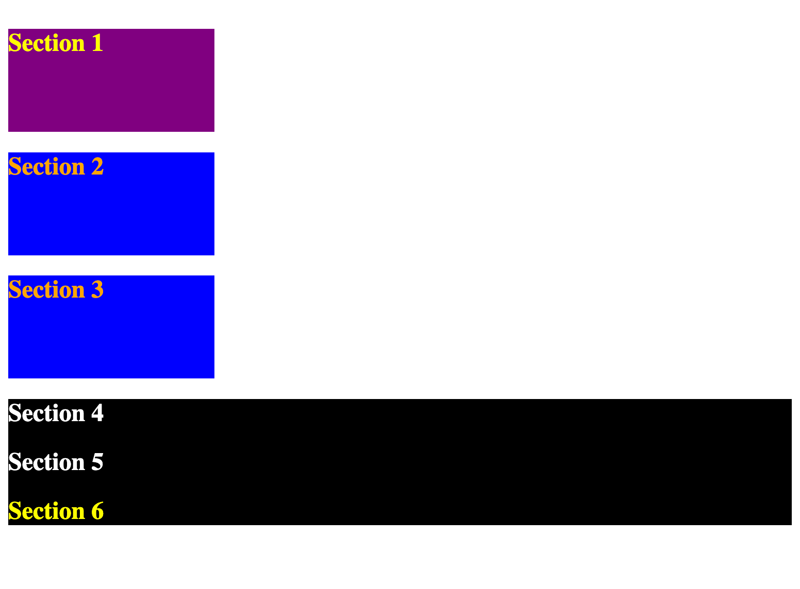
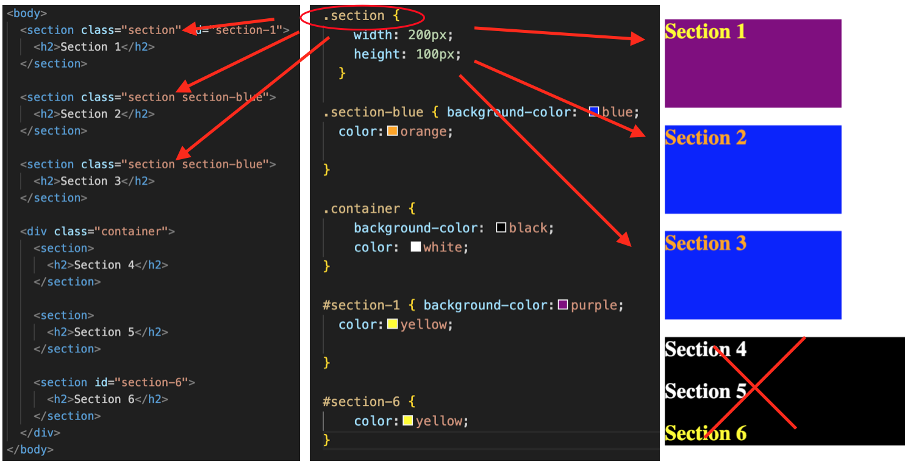

# basicCss

## Creating a basic webpage to apply CSS

Each number is divided into section tags in HTML so it will be easier to apply styling and visualize the effects of class and id's.

## Updating the webpage

The updated webpage displays styling to each section's that are grouped through classes or individually changed by id's. 

## Understanding the groups of classes and separation of id's and their effects in styling

